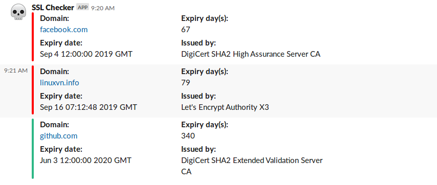

## Check SSL Expiry and send notify to Slack

- Create a Slack channel and get Webhook Incomming
- Fill your information into script
- Run script

> ./ssl-checker.sh linuxvn.info

### Reference
- Special thanks to [@andrew](https://stackoverflow.com/users/538507/andrew)
- https://stackoverflow.com/questions/21297853/how-to-determine-ssl-cert-expiration-date-from-a-pem-encoded-certificate
